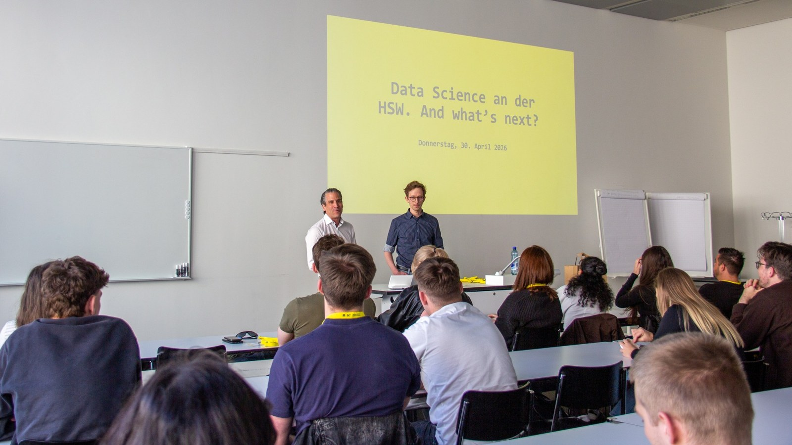

One of my favorite teaching obligations is the one in our Major titled **Managerial Data Science**, which I developed together with my colleague Fabian Heimsch in 2022 and have since continuously updated. Students at FHNW can choose it during their last year of their Bachelor programs (either in Business Administration or International Management). The Major accounts for 20 ECTS in total. In my 5-ECTS module, we learn the basics of Machine Learning.

Currently, we are about to finish classes with the fourth generation of students in our Major. While previous generations have been excited to enter the job market after completing their Bachelors with our Major, things look a bit more complicated this year. The job market for knowledge work in general and Data Science jobs in particular is somewhat dry and companies seem to be hesitant to hire. While there seems to be some general consolidation going on, with companies trying to cut costs, the emergence of unforeseen AI-capabilities has led to a lot of uncertainty about how the future of Data Science jobs looks.

This spring I decided that we need to provide our students a more clear perspective for what may be their next realistic career move. For this, we invited all Alumni from our Major that we were able to contact. On April 30 we were able to welcome about 20 Alumni, our current students as well as 10 students that are interested in the next run of the Major. After a small "tour d'horizon" of our Major, some of the Alumni presented their next career steps, elaborated on how the Major helped them in their career, and what skills or concepts were missing looking back. Moreover, they provided some insight in how AI has or will reshape their jobs.

{height="400"}
Here are some of my take-aways from the Alumni's experiences:

* The type of positions our graduates get is quite broad and goes beyond Business and Data Analytics and for example includes jobs in Project Management, Banking or Controlling.
* However, the most frequently mentioned role is still Business Analyst.
* An emerging category of jobs seems to be AI-based jobs such as AI Agent Engineer.
* Some of our former students have made successful transitions to Universities for their Masters.
* Even though most of the Alumni do not need to write much code anymore due to AI automation, they still appreciate having acquired coding skills during the Major.
* They say the Major has allowed them to acquire analytical thinking skills and a general understanding of what data are and in what flavors they come.
* A practical skill we do not cover enough in our Major is Business Intelligence. A lot of our Alumni's daily bread and butter is using tools such as PowerBI.
* Fortunately, most of our Alumni do not seem to be worried about being replaced by AI.

Overall, it was a very nice event that hopefully allowed our current and possible future students to get a good idea of job profiles that may open up for them.

I strongly believe that AI will lead to a world in which people who can successfully navigate between the business/domain side and the technical/analytical side and facilitate the communication between the two will be in high demand.
