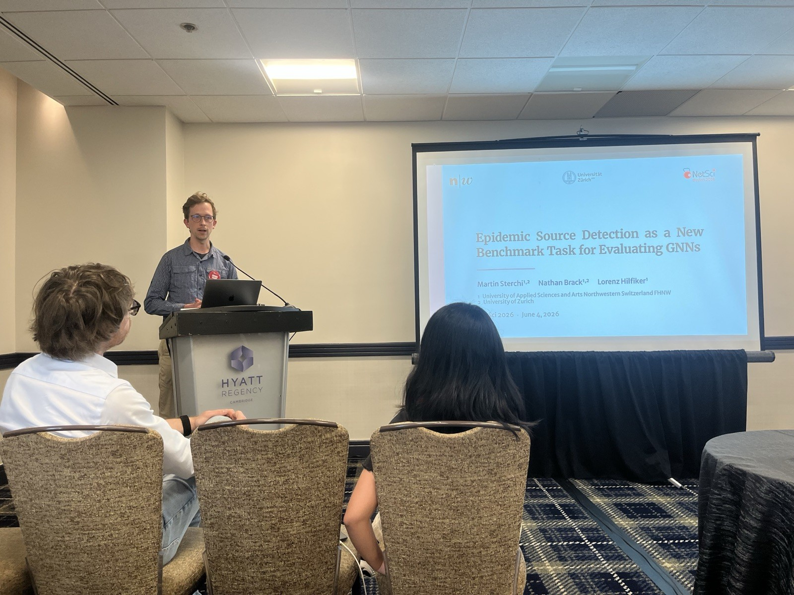
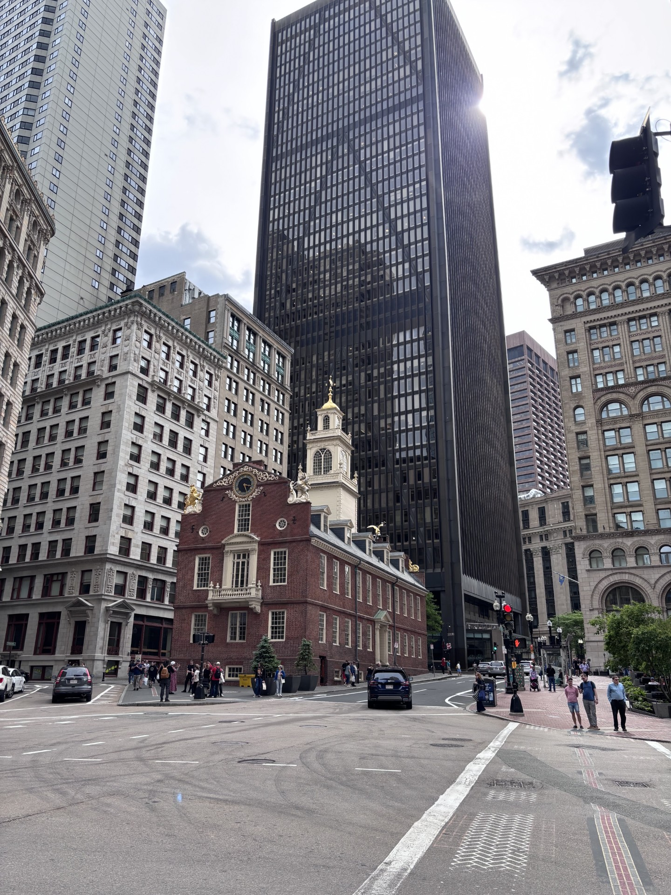
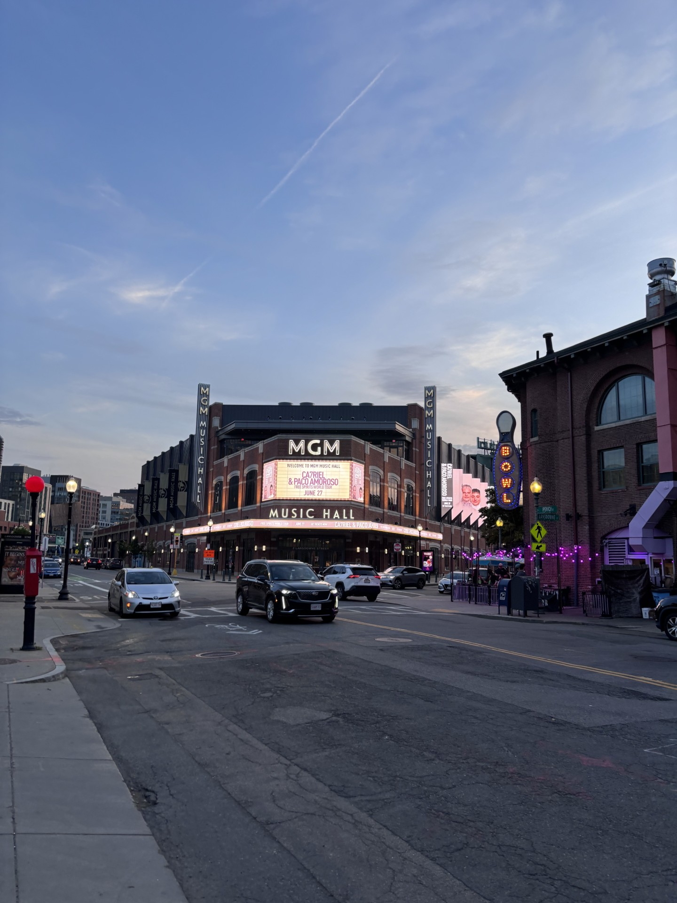

Together with two colleagues (Lorenz and Nathan), we attended the main NetSci conference in June, which took place in Boston, USA. This was our second time, after first attending last year in Maastricht. This year we presented two posters and gave a lightning talk and a parallel session talk.

My talk (the parallel session one) presented our work on using GNNs for epidemic source detection. Our goal is for the community to adopt this as a new benchmark task for evaluating GNN architectures and designs on static networks. The corresponding paper is available on [arXiv](https://arxiv.org/html/2512.20657v2) and is currently under review with a CS journal.

The lightning talk (presented by Lorenz), together with one of the posters, covered a new proper scoring rule for evaluating node selection tasks on graphs. The second poster, presented by Nathan, looked at scaling laws for source detection. Both works will soon be available on arXiv.

{height="600"}

Every good conference visit allows a little bit of time to explore the venue, which we did! Boston is an amazing city that is surprisingly walkable.

Here are some impressions:

::: {layout-ncol="2"}

:::
